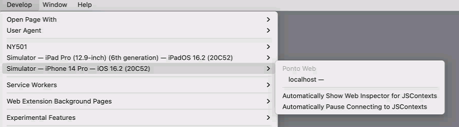

# Ambiente MacinCloud

O ambiente Mac disponibilizado pela Nasajon para desenvolvimento de aplicações das plataformas Mac/iOS é o serviço em nuvem [MacinCloud](https://www.macincloud.com/), do qual fazemos acesso remoto á máquina contratada.

## Realizando login
Quando acesso for disponibilizado, você receberá as credenciais para login, junto com o hostname e um arquivo zip, contendo diversos arquivos .rdp:


- **Windows**
    Ao extrair o arquivo zip, você identificara uma pasta com os diversos arquivos .rdp para diferentes configurações, basta executar o arquivo .rdp desejando, prosseguir e quando a conexão for estabelecida, realize o login com as credenciais recebidas.
    [Video tutorial](https://www.youtube.com/watch?v=kjXMAr9nlS0)
- **Linux**
    Você precisará instalar o pacote rdesktop:
    ``sudo apt install rdesktop`` 
    E rodar o comando:
    ``rdesktop hostname:6000`` 
    Substitua o hostname pelo que foi recebido junto com as credenciais. (Caso não tenha recebido, solicitar para quem lhe forneceu o acesso.)
- **Navegador**
    Para acessar através do navegador, utilize a url
    ``https://[region]bc01.macincloud.com/rdpdirect.html?server=[servername]``
    E troque *[region]* pelas duas primeira letras do hostname, e o *[servername]* pelo hostname
    Ex: Hostname LA999
    ``https://labc01.macincloud.com/rdpdirect.html?server=LA999``
    E acesse a máquina normalmente.

### Atenção:
Sempre realize o logout após o uso da máquina:
Clique no simbolo da Apple e em Log out (nome do usuário)

### Troubleshooting

Caso ocorra algum erro durante a conexão com a máquina no Windows. Verifique e abra a porta 6000 no seu firewall. [Tutorial](https://www.tomshardware.com/news/how-to-open-firewall-ports-in-windows-10,36451.html)

## Conhecendo o ambiente
A máquina já vem pré configurada com diversos programas para desenvolvimento. Incluindo VSCode, Android Studio, Xcode, node.js, npm, git, etc.

### Utilizando o git

1. **Configurando usuário git**
    Ao realizar o login na máquina, configure seu usuário git:
    ```
    git config --global user.name "Seu Nome"
    ```
    ```
    git config --global user.email "sua-identidade-nasajon@nasajon.com.br"
    ```
    

2. **Gere a chave ssh:**

    ```
    ssh-keygen -t rsa -b 4096 -C "sua-identidade-nasajon@nasajon.com.br"
    ```
    Vá ao diretório `.ssh` com o comando `cd .ssh`

    No diretório `.ssh`, a chave gerada está no arquivo `id_rsa.pub`. Execute: 
    ```
    cat id_rsa.pub
    ```
    No GitHub, clique na sua foto de perfil, vá em `Settings`>`SSH and GPG Keys`>`New SSH key` e cole, no campo `Key`, toda a chave gerada no passo anterior. Escolha um `title` para identificar essa chave e salve.
    > Caso ja tenha uma chave `ssh` configurada na máquina, siga os passos descritos na etapa *Reconfigurando o usuário*.

3. **Verificando usuário:**
    Para verificar se consegui configurar o usuário com sucesso, execute:
    ```
    ssh -T git@github.com
    ```
    Se tudo estiver correto, você deve ver a mensagem `Hello Fulano! You've successfully authenticated, but GitHub does not provide shell access.`.

4. **Finalizando a seção:**
    Ao terminar o uso da máquina, para que outros usuários também possam utilizar o git, vá para o diretório `.ssh`
    renomeie os arquivos `id_rsa` e `id_rsa.pub` adicionando o seu nome no final para identificação, caso volte a utilizar novamente.

    ```
    mv id_rsa id_rsa_fulano
    ```
    ```
    mv id_rsa.pub id_rsa_fulano.pub
    ```
5. **Reconfigurando o usuário:**
    Para voltar a utilizar a sua chave, basta renomear novamente para `id_rsa` e `id_rsa.pub`, não se esqueça de adicionar novamente seu usuário para o `git config --global` do primeiro passo. 

### Instalando outros programas

Caso você precise de algum programa além dos que ja estão pré-instalados:
- **App Store**:
    Procure pelo programa na App Store, pois é facilmente instalado e geralmente não requer acesso de administrador. 
- **Programas baixados**:
    Para os programas que são baixados através do site do mesmo, basta clicar duas vezes no arquivo baixado, e no momento que pedir para arrastar para a pasta *Applications*, arreste o ícone do programa para o a área de trabalho.
    
- **Terminal**:
    E para os programas que são executados pelo terminal - *yarn* que utilizamos bastante na Nasajon por exemplo - devem ser instalados com comando sudo, sendo assim requerem acesso de administrador do qual não possuímos.
    Para isso, devemos solicitar ao responsável pelo acesso, que abra um tíquete no portal do MacinCloud solicitando a instalação do programa.
    Serão necessárias algumas informações como: 
    **Application name:** yarn
    **Website URL:** https://yarnpkg.com/
    **Installation command:** npm install -g yarn

### Troubleshooting
Caso durante a instalação do seu projeto, apresente incompatibilidade com a versão do node que vem pré-instalada. Faça o downgrade com os seguintes passos:
1. Baixe e instale o NVM:
```
touch ~/.bash_profile
curl -o- https://raw.githubusercontent.com/creationix/nvm/v0.32.1/install.sh | bash
```
2. Exporte a variável NVM_DIR para o path local.
```
export NVM_DIR="$(cd ~/ || exit 1;pwd)/.nvm"
```
3. Ative o ambiente NVM rodando o nvm.sh
```
[ -s "$NVM_DIR/nvm.sh" ] && . "$NVM_DIR/nvm.sh"
```
4. E por fim, instale a versão do node desejada com o comando:
```
nvm install [node_version]
```

## Utilizando o Simulador

Para acessar o simulador e rodar a nossa aplicação:
1. Acesse o Xcode
2. Clique em "Open a project or file"
3. Navegue até onde foi gerado o build da aplicação para iOS.
4. Identifique o arquivo com a extensão .xcworkspace (Ex: Nome do Projeto.xcworkspace)
5. Clique em "open", e abrirá a o Xcode exibindo algumas informações.
6. No header do program, você identificará algumas informações como o nome do projeto e ao lado a plataforma que será executada a aplicação no simulador.
Ex: 
7. Clique no ícone de "play" e a aplicação começara a rodar no simulador.
8. Para alterar a plataforma que deseja testar a aplicação, clique na plataforma ao lado do nome da aplicação, e será exibido um menu com diversas plataformas da Apple, basta selecionar e clicar novamente no ícone de "play"

### Debugando o simulador pelo Safari
1. Abra o Safari.
2. Ative o menu Develop no Safari, se ainda não estiver ativado.
    2.1 Para fazer isso, vá para Safari—> Preferences. Em seguida, vá para a guia Advanced e marque a opção "Show Develop menu in menu bar". 
3. Com o simulador aberto, e rodando a sua aplicação:
4. Vá para o Safari clique em Develop, irá aparecer o menu, com diversas opções, identifique a Simulator - Nome da plataforma (depende de qual você esta utilizando para testar) -> localhost.

5. Ao clicar em localhost, irá abrir o inspetor da web no Safari, mas na nossa aplicação do iOS Simulator, e basta utilizar assim como fazemos com o DevTools do google chrome.

### Referências
- [Access Your MacinCloud Managed Server Through a Web Browser](https://support.macincloud.com/support/solutions/articles/8000093372-access-your-macincloud-managed-server-through-a-web-browser)
- [How To Open Firewall Ports In Windows 10](https://www.tomshardware.com/news/how-to-open-firewall-ports-in-windows-10,36451.html)
- [rdesktop](https://github.com/rdesktop/rdesktop)
- [Installing software on the Managed & Pay-As-You-Go server plan](https://support.macincloud.com/support/solutions/articles/8000054252-installing-software-on-the-managed-pay-as-you-go-server-plan)
- [How to Manage your Node Version with NVM on a MacinCloud Managed Server](https://support.macincloud.com/support/solutions/articles/8000094204-how-to-manage-your-node-version-with-nvm-on-a-macincloud-managed-server)
- [Web Inspector with iOS Simulator](https://unrealnavigation.com/blog/web-inspector-with-ios-simulator)